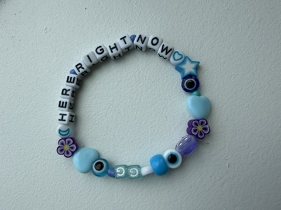
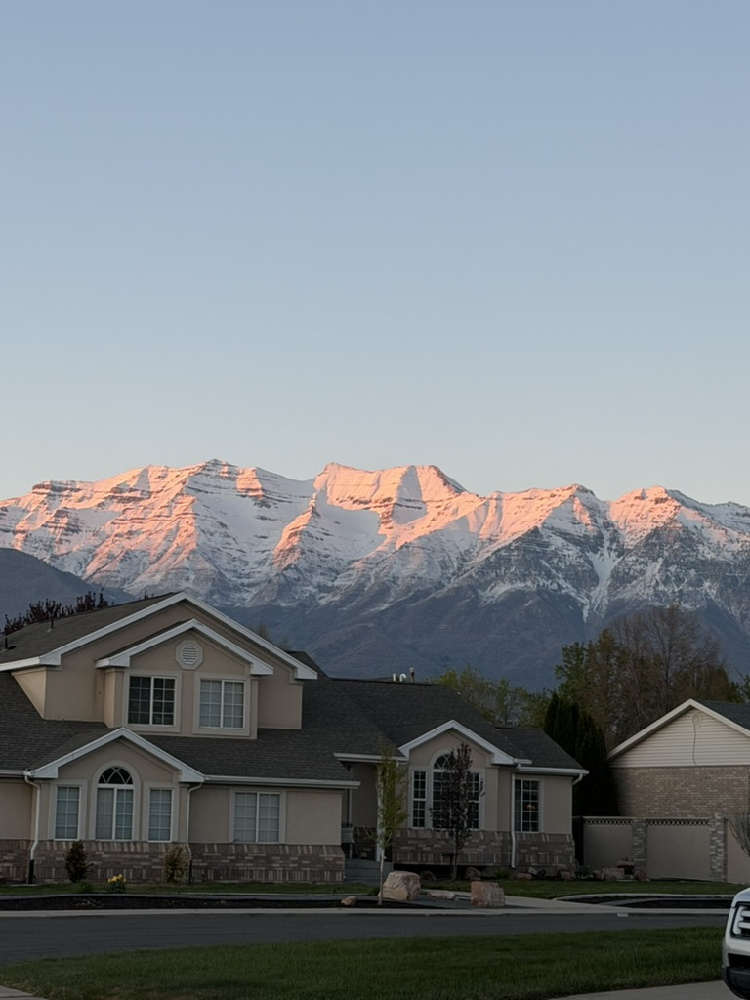

About a year ago now I became acutely aware of my own mortality. I can't pin down exactly what prompted this but it was a pretty scary realization. I don't know why it was such a shock to me - _"what do you mean I won't live forever?"_ - but after some processing, I came away with a new mindset. Remembering that I'll die someday has oddly been a blessing. 

I was recently laid off and I've found myself with more free time than perhaps I've ever had. I've been revisiting old hobbies and picking up new ones, and I've found therapeutic release in beading. I've made a series of bracelets with stoic sayings: "MEMENTO MORI", "AMOR FATI", "HERE RIGHT NOW".

The mountains here in Utah are simply gorgeous. They're visible everywhere you drive and I have a hard time articulating how much I love them! Every time I experience a particularly beautiful sunset, with the snowcapped peaks alight with alpenglow, I remember how it could be my last, how tomorrow isn't promised. My anxieties and worries fade away and all that actually matters is that moment.

And yet, more often than not my mind remains firmly elsewhere. I know I shouldn't be upset with myself - everyone struggles to stay present - but I can't help but feel discouraged. That said, I firmly believe that more important than position is direction. Marcus Aurelius writes at length in _Meditations_ about constant and consistent 'redirection'. No shame, just a steady correction. 

So when I look at my wrist and see "HERE RIGHT NOW", I remember that I don't make these bracelets because I've got it figured out, I make them because I haven't.

